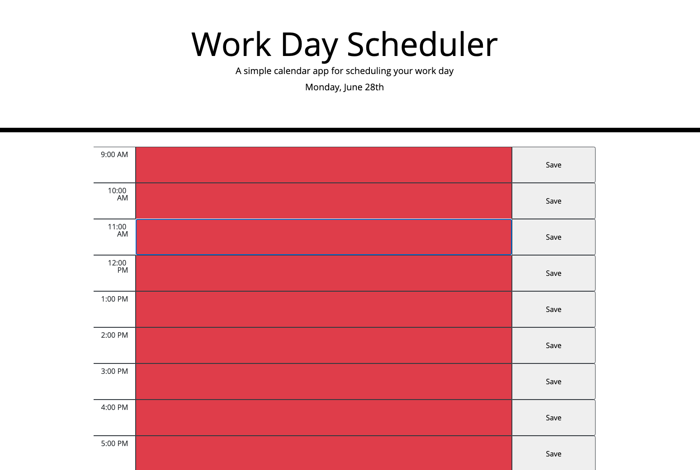

# 05 Third-Party APIs: Work Day Scheduler

## Table of Contents
* [General info](#general-info)
* [Screenshot](#screenshot)
* [Technologies](#technologies)
* [Setup](#setup)
* [User Story](#User-Story)
* [Acceptance Criteria](#Acceptance-Criteria)

## General Info
A simple calendar application that allows a user to save events for each hour of the day by modifying starter code. This app will run in the browser and feature dynamically updated HTML and CSS powered by jQuery.

A demo of this can be found on Github pages here: https://rgultiano.github.io/06-day-planner/

## Screenshot


## Technologies
Project is created with:
* HTML 5
* CSS
* Javascript
* JQuery
* moment.js

## Setup
To run this project, just copy the index.html and assets folder to your webserver.

You can modify some of the config attributes in ordder to give some variance to your schedule. These are found at the top of `assets\js\script.js\`. The default values are:
```js
//CONFIG VARIABLES
//set start and end of day constants for the planner using 24 hours
const CONF_START_OF_DAY = "9:00 AM"; // beginning time for the planner (inclusive)
const CONF_END_OF_DAY = "6:00 PM"; // end time for the planner (exclusive. i.e. it won't include this time if it perfectly matches a start of a timeblock)
const CONF_TIME_OF_DAY_FORMAT = "h:mm A"; // moment format for *_OF_DAY constants

//set visual representation of the label
const CONF_PLANNER_DISPLAY_FORMAT = "h:mm A"; //note this is not included in the checkAndHandleConfig() check as it's simply visual

const CONF_TIME_BLOCK_INTERVAL = 60; // time block interval 
const CONF_TIME_BLOCK_INTERVAL_UNIT = 'minutes'; // moment unit for timeblock interval (e.g. 'hours', 'minutes')

const CONF_PLANNER_SAVE_FORMAT = 'x';// moment format used for saving events into local storage
```

## User Story

```md
AS AN employee with a busy schedule
I WANT to add important events to a daily planner
SO THAT I can manage my time effectively
```

## Acceptance Criteria

```md
GIVEN I am using a daily planner to create a schedule
WHEN I open the planner
THEN the current day is displayed at the top of the calendar
WHEN I scroll down
THEN I am presented with timeblocks for standard business hours
WHEN I view the timeblocks for that day
THEN each timeblock is color coded to indicate whether it is in the past, present, or future
WHEN I click into a timeblock
THEN I can enter an event
WHEN I click the save button for that timeblock
THEN the text for that event is saved in local storage
WHEN I refresh the page
THEN the saved events persist
```

